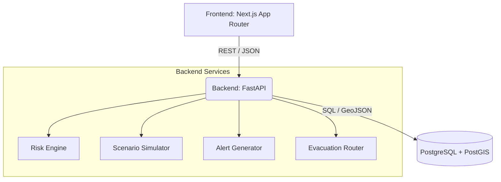
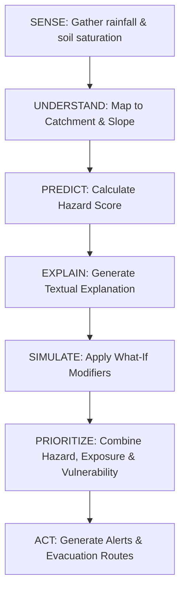
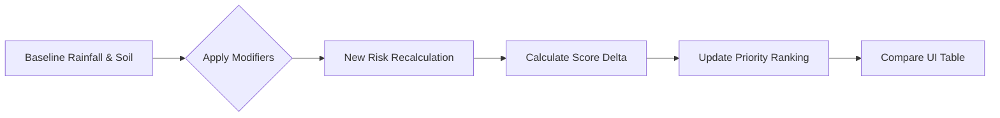
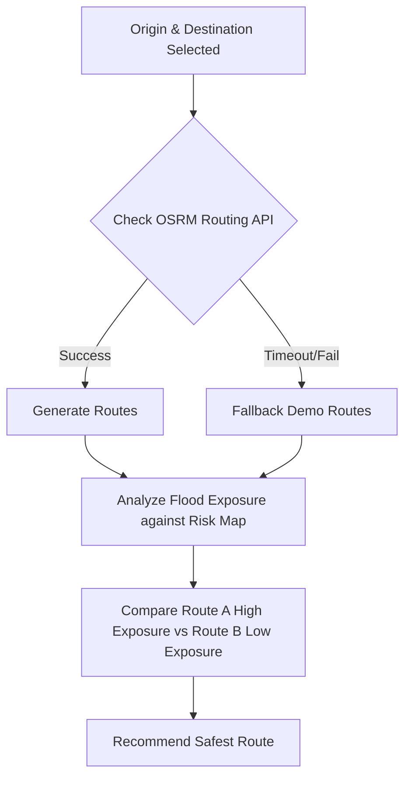

# FlashGuard AI Architecture

## 1. System Architecture

```mermaid
flowchart TD
    A[Frontend: Next.js App Router] -->|REST / JSON| B(Backend: FastAPI)
    B -->|SQL / GeoJSON| C[(PostgreSQL + PostGIS)]
    
    subgraph Backend Services
    B --> D[Risk Engine]
    B --> E[Scenario Simulator]
    B --> F[Alert Generator]
    B --> G[Evacuation Router]
    end
```

## 2. Data Flow

```mermaid
flowchart LR
    A[seed_db.py] -->|Populates| B[(Database)]
    B -->|Fetches Data| C[Risk Engine]
    C -->|Calculates Baseline| D[FastAPI Endpoints]
    D -->|JSON| E[Next.js Frontend]
    E -->|Rendered| F[Decision Support UI]
```

## 3. FlashGuard Decision Intelligence Flow

```mermaid
flowchart TD
    A[SENSE: Gather rainfall & soil saturation] --> B[UNDERSTAND: Map to Catchment & Slope]
    B --> C[PREDICT: Calculate Hazard Score]
    C --> D[EXPLAIN: Generate Textual Explanation]
    D --> E[SIMULATE: Apply What-If Modifiers]
    E --> F[PRIORITIZE: Combine Hazard, Exposure & Vulnerability]
    F --> G[ACT: Generate Alerts & Evacuation Routes]
```

## 4. What-If Scenario Flow

```mermaid
flowchart LR
    A[Baseline Rainfall & Soil] --> B{Apply Modifiers}
    B --> C[New Risk Recalculation]
    C --> D[Calculate Score Delta]
    D --> E[Update Priority Ranking]
    E --> F[Compare UI Table]
```

## 5. Evacuation Flow

```mermaid
flowchart TD
    A[Origin & Destination Selected] --> B{Check OSRM Routing API}
    B -->|Success| C[Generate Routes]
    B -->|Timeout/Fail| D[Fallback Demo Routes]
    C --> E[Analyze Flood Exposure against Risk Map]
    D --> E
    E --> F[Compare Route A High Exposure vs Route B Low Exposure]
    F --> G[Recommend Safest Route]
```
